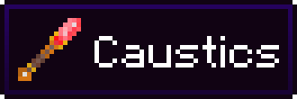

<h2>
<b>New crystals and an infraustructure-based transportation system. What more could you want?</b>
</h2>
 

 

Caustics add several new crystal types. The cluster from each type can be joined together by any crystal block to form a node. Each crystal type has its own purpose:

| Crystal Type | Purpose                                                                          |
|--------------|----------------------------------------------------------------------------------|
| Sapphire     | Makes a node discoverable with the alidade                                       |
| Beryl        | Used to craft the alidade                                                        |
| Peridot      | Defines where the player is teleported to when a node is used                    |
| Topaz        | Extends the range that alidades can see nodes                                    |
| Sunstone     | Adds the node to a network. Alidades can be tuned to only see a specific network |
| Selenite     | Stores light that enables nodes or leapers to work in low light levels           |
| Tourmaline   | Jams all signals that attempt to cross the signal range boundary                 |

## License

---
This project is under an MIT license